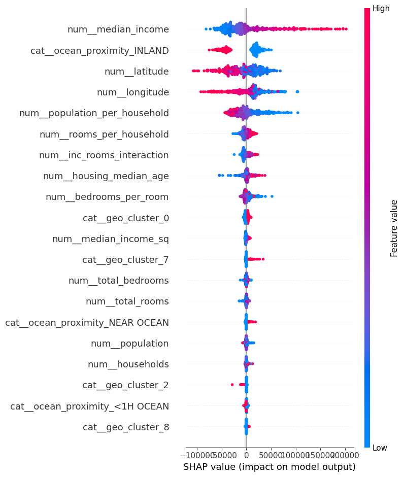

# California Housing Price Pipeline

I built an end-to-end ML pipeline that takes raw California housing data and turns it into spot-on home-value predictions. Here’s the rundown:

---

## 1. Smart Feature Engineering  
- **Household Ratios:** rooms / household, bedrooms / room, population / household  
- **Polynomial & Interaction Terms:** squared median income, income × rooms per household  
- **Geo & Income Buckets:** K-means clusters on (lat, lon) and income quintile bins  

## 2. Bayesian-Tuned XGBoost  
- Wrapped an XGBoost regressor in a `TransformedTargetRegressor` to model `log(price)`  
- Ran a Bayesian hyperparameter search (via `skopt.BayesSearchCV`) over:  
  - number of trees, learning rate, max depth  
  - subsample / colsample ratios, L1/L2 regularization  
- **5-Fold CV Results:**  
  - **RMSE:** 45 860  
  - **R²:** 0.843  

## 3. Explainability with SHAP  
  
- **Top Drivers:**  
  1. **Median income** (higher → higher prices)  
  2. **Inland vs. Coastal** (inland pushes prices down)  
  3. **Latitude/Longitude**  
- My custom ratios and clusters sit mid-rank—proof the extra engineering paid off.

## 4. Feature Pruning  
- Dropped the bottom 5 % of features by importance  
- **Pruned XGB RMSE:** 47 207 (small trade-off for a leaner model)

## 5. Stacked Ensemble  
- Combined **XGBoost + Random Forest + Lasso** (as meta-learner)  
- **Test-Set RMSE:** 44 346  (another ≈ 1 500 improvement)

## 6. Spatial Residual Analysis  
- Mapped over-/under-predictions back onto latitude/longitude  
- **Interactive Map:** `residuals_map.html` shows red (under-predicted) vs. blue (over-predicted) areas—great clues for adding local features like school districts or amenities!

---

### Bottom Line  
From raw CSV to a **44 k-dollar RMSE**, this pipeline taught me tons about:
- Feature engineering and spatial clustering  
- Bayesian hyperparameter tuning  
- Model interpretability (SHAP)  
- Pruning for simplicity  
- Ensembling to squeeze out extra accuracy  

Feel free to dive into the code, explore the SHAP plot, or click through the residuals map.

## Quickstart

pip install -r requirements.txt
python california_housing_prediction.py
